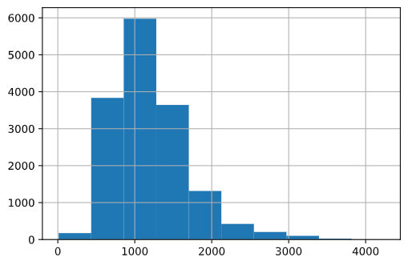
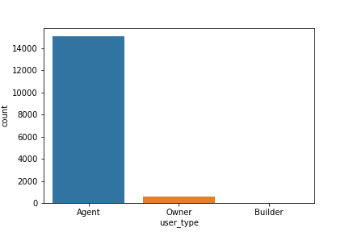
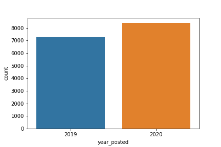
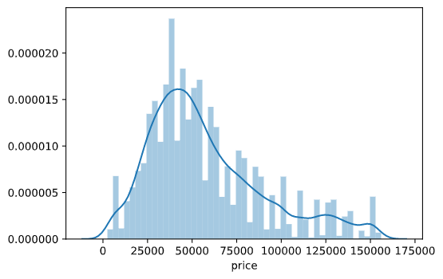
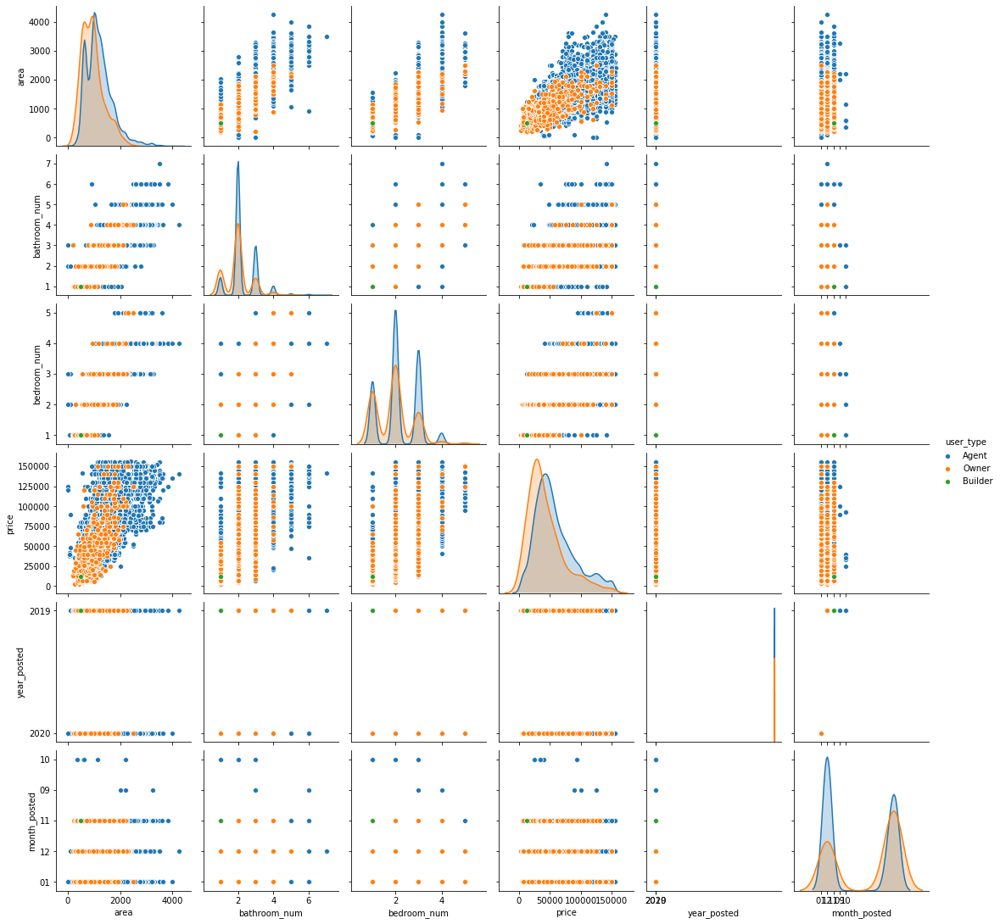
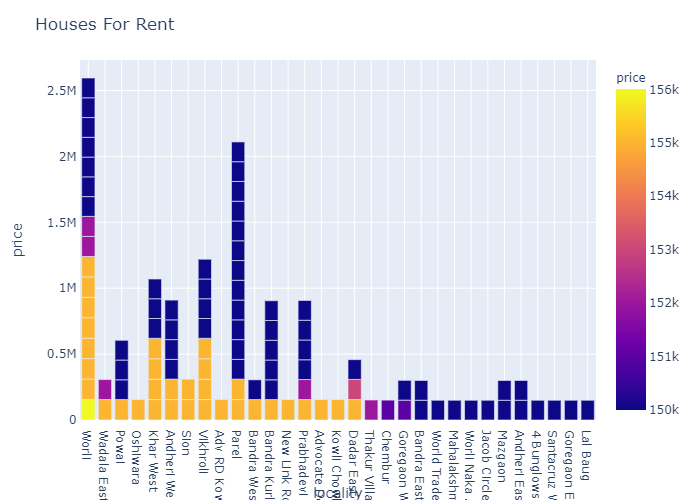
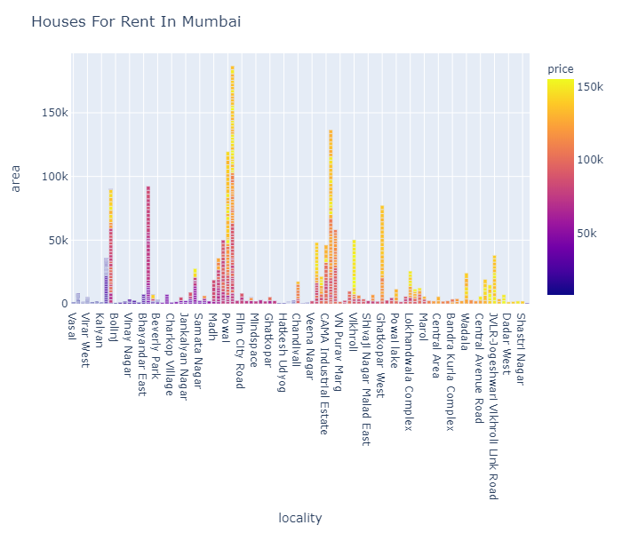

# Bombay_Rent_House_Analysis

Data set taken from Kaggle: https://www.kaggle.com/jedipro/flats-for-rent-in-mumbai

**Credits**
1. Plotly Diagrams:  https://www.kaggle.com/shreekant009/mumbai-house-price-with-plotly
2. Scatter Plot: https://www.youtube.com/watch?v=cbqZa_1vzcg&list=PLeo1K3hjS3uu7clOTtwsp94PcHbzqpAdg&index=5&t=0s

# Download
```
# Clone or download the repository
$ git clone https://github.com/Mega-Barrel/Bombay_Rent_House_Analysis.git

# Install matplotlib, plotly, seaborn, numpy, pandas
$ pip install numpy
$ pip install seaborn
$ pip install matplotlib
$ pip install seaborn
$ pip install plotly
```
# Removing all the null values

```python
# Displaying total null values as per column
df.isnull().sum()

# Removing all the null values
df.dropna()
```

# Detecting the Outliers

```python
Q1 = df2.price.quantile(0.25)
Q3 = df2.price.quantile(0.75)

IQR = Q3 - Q1

lower_limit = Q1 - 1.5*(IQR)
upper_limit = Q3 + 1.5*(IQR)
```

# Histogram for Area Column


The Area Column follows the Bell curve or Binomial Distribution with area = 6000 highest.

# User Count


In the above diagram, we can see that Agent acts as a middle-person and highest number of Flats for Rent; And builder has very very less amount of flats for Rent.

# Year Count


The renter population has become more than the previous year.

# Price Distribution 


# PairPlot


# Barchart for Houses


# Bar graph for Locality


In the above diagram we can see that Powai has High number of Flats for Rent with higher rent price.

Vasai, Virar West, Kalyan and many more has lower number of Flasts with less Rent

